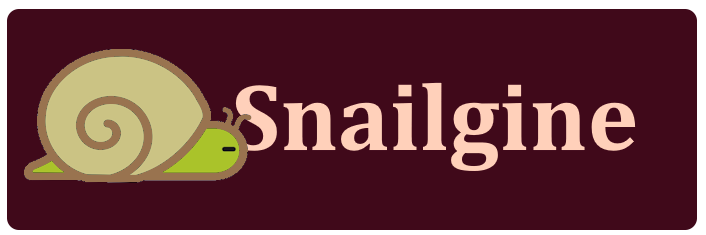

  
  <h1>Snailgine - a modern C++ game engine</h1>

A general-purpose 2D game engine made in C++, with scripting, physics and much more.

## Structure
Everything is an object, you can make different kinds of objects which all have position, scale, rotation, texture and color attributes. You can make scripts and add them to the objects to define logic for those objects.

## Building
Simply open the visual studio solution and hit run.

## Features
- The engine has 2d physics with Box2D, you can make box colliders, and custom colliders. 
- You can play sound with OpenAL. 
- You can add logic to objects with scripts that you can make in a code editor.
- Saving and loading scenes.
- 2D lighting.
